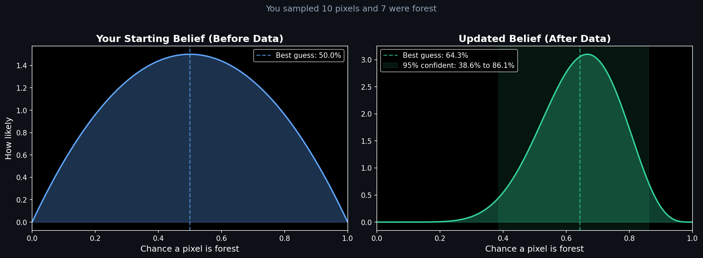
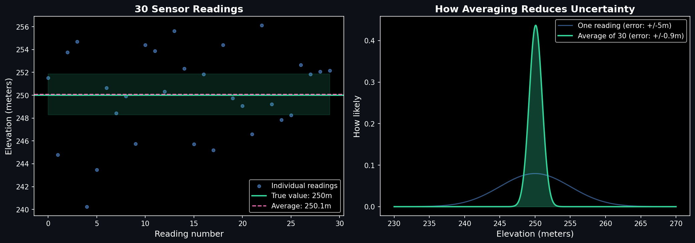
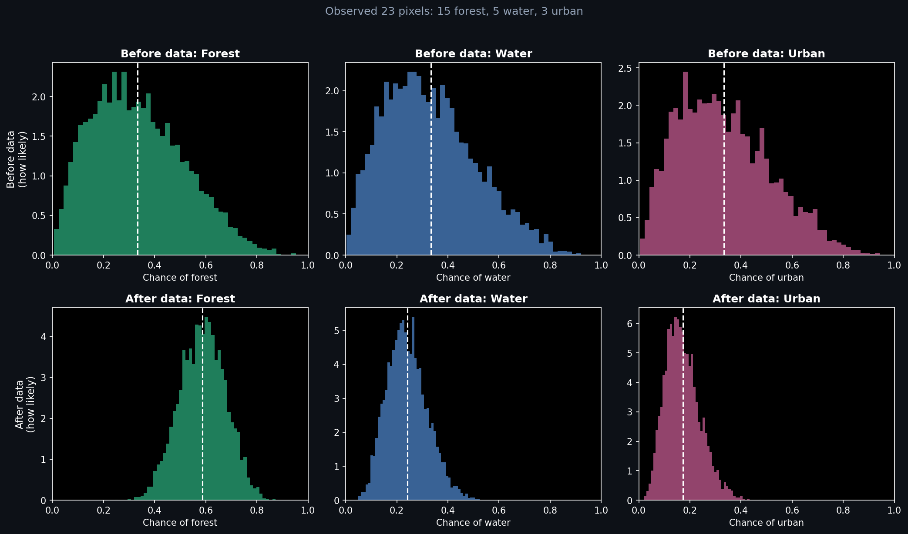

# Probability Distribution Dashboard

Interactive notebook for understanding uncertainty in geospatial problems. You drag sliders, the charts update, and you see how adding more data changes your confidence.

Part of my [35-project AI Engineering Roadmap](https://ai-engineer-roadmap-ee841.web.app/projects).

---

## What it does

- Shows how your confidence in a satellite classification changes as you look at more pixels
- Demonstrates why averaging more sensor readings gives you a better estimate (and by exactly how much)
- Visualizes what happens when you need to estimate the mix of multiple land types at once (forest, water, urban)
- All three sections have sliders so you can experiment and build intuition

### How does your confidence change with more data?



### How many sensor readings do you actually need?



### What about multiple land types at once?



---

## Project structure

```
geoai-probability-distribution-dashboard/
├── probability_dashboard.ipynb   # Main interactive notebook
├── distributions.py              # Math functions for all three distributions
├── tests/
│   └── test_distributions.py     # 15 unit tests
├── requirements.txt
└── README.md
```

---

## Setup

```bash
pip install -r requirements.txt
```

---

## Running the dashboard

```bash
jupyter notebook probability_dashboard.ipynb
```

Each section has sliders. Drag them and the plots redraw immediately.

---

## What I learned

### How sure are you about a classification?

When you look at a satellite image and try to decide whether a pixel is forest or not, you are making a guess. The Beta distribution is a way to draw that guess as a curve. A wide, flat curve means "could be anything." A tall, narrow curve means "I am fairly sure."

The useful part: when you look at more pixels, the curve automatically narrows. If you sample 10 pixels and 7 are forest, the curve shifts toward 70% and gets tighter. The math behind this is called Bayesian updating, and it turns out to be simple addition. You just add your observed counts to the shape of the curve. That is it. No complex algorithms.

### How many readings do you need?

If a sensor measures an elevation of 250 meters, a single reading might be off by 5 meters in either direction. But if you take 4 readings and average them, the error drops by half. Take 100 readings and the error drops by 10x.

This is a fundamental rule that shows up everywhere in geospatial work. When satellite providers combine multiple passes over the same area, they are doing exactly this. The tradeoff is clear: more data always helps, but each additional reading helps less than the last. Going from 1 reading to 4 is a bigger deal than going from 100 to 400.

### What if there are more than two classes?

The first section handles two options: forest or not forest. But real land cover maps have many categories like forest, water, and urban. The Dirichlet distribution handles this. It represents all the possible ways those categories could be split, where the percentages always add up to 100%.

The key thing I took away: a single number called "concentration" tells you how confident the model is about the mix. Low concentration means the model is unsure and the answer could go any direction. High concentration means it is fairly locked in. This is directly related to how machine learning classifiers work. When a model says "65% forest, 22% water, 13% urban," those numbers are not certainties. They are one possible answer drawn from a range of possibilities.

---

## Tests

```bash
python -m pytest tests/test_distributions.py -v
```

Fifteen tests covering the core math: updating beliefs with new data, confidence intervals shrinking with more samples, multi-class percentages always adding up to 1, and edge cases like starting with zero knowledge.

---

## Dataset

No external data. All observations are generated synthetically to represent realistic scenarios like sampling satellite pixels and taking elevation readings.
